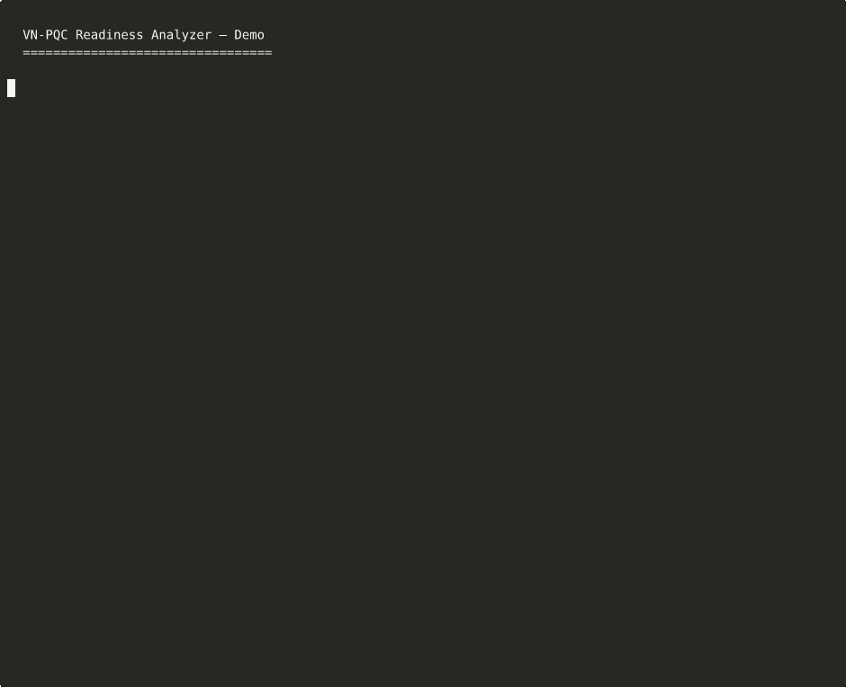
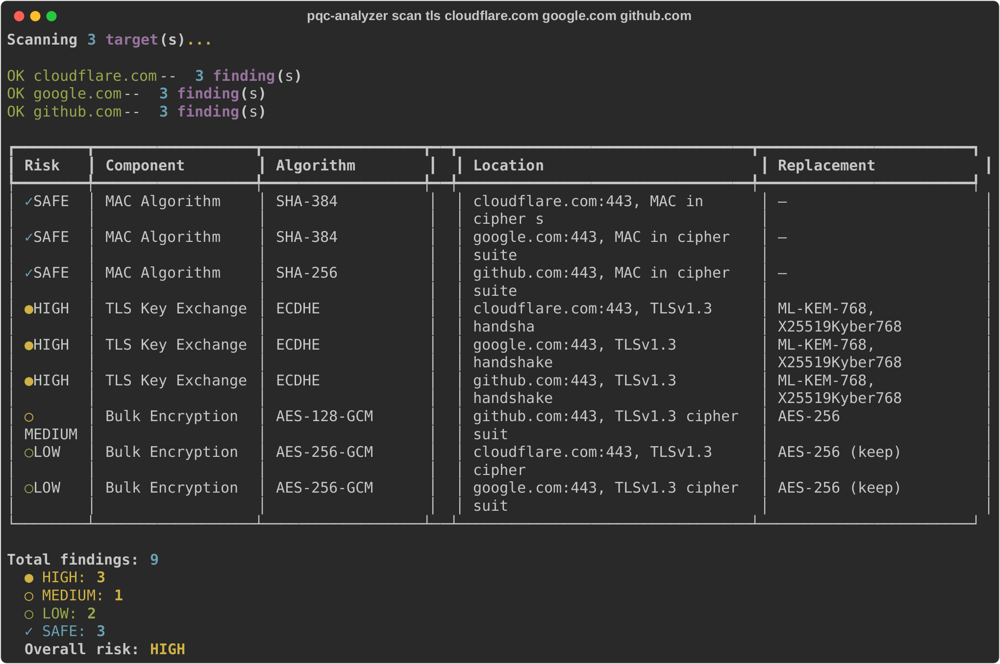
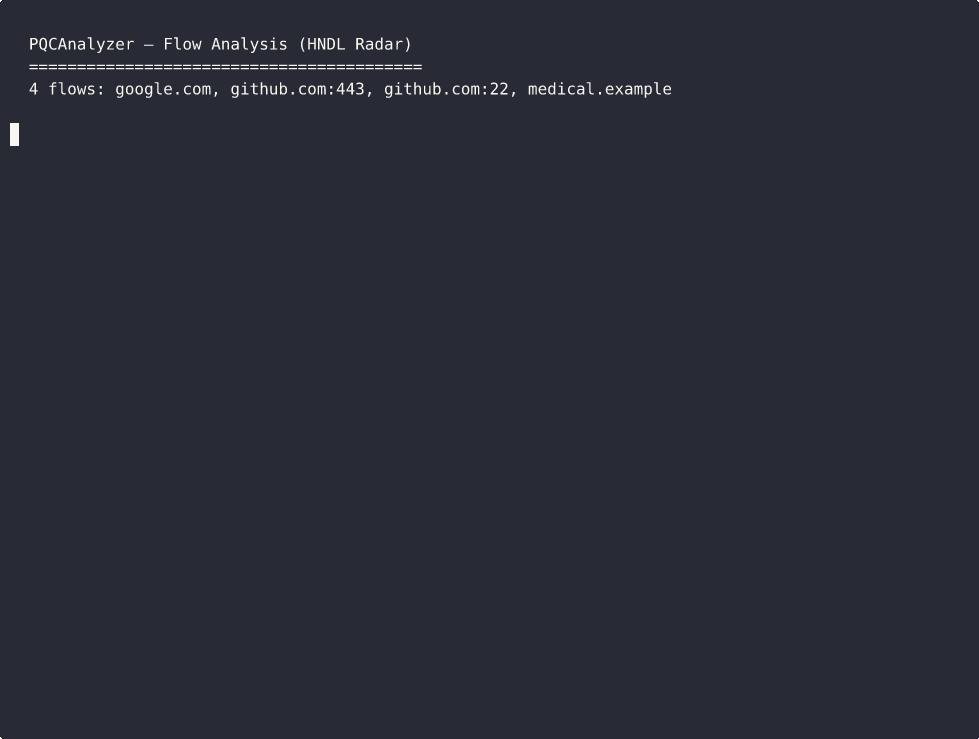

# VN-PQC Readiness Analyzer

[](https://github.com/xuxu298/PQCAnalyzer/actions)
[](https://python.org)
[](LICENSE)
[](https://github.com/xuxu298/PQCAnalyzer)

> **NIST has finalized post-quantum standards. Your TLS, SSH, and VPN are running dead algorithms. This tool tells you exactly what to fix, how long it takes, and how much it costs.**

Scan your infrastructure for quantum-vulnerable cryptography. Get a migration roadmap with cost estimates. NIST FIPS 203/204 compliant.

[Tieng Viet](#tieng-viet) | [English](#features)



### Scan output at a glance



Cloudflare and Google now serve hybrid `X25519MLKEM768` (IANA 0x11EC) by default — the scanner detects this via an active TLS 1.3 ClientHello probe and marks those endpoints SAFE. GitHub still negotiates classical `ECDHE`, so it gets flagged `HIGH` with the NIST FIPS 203 replacement (`ML-KEM-768`) called out. The scan surfaces what's actually on the wire, not what a server *could* support.

### Flow Analysis (HNDL Radar) in action



`scan pcap` groups packets into 5-tuple flows, parses the TLS/SSH handshake, classifies each flow's data sensitivity from SNI/port rules, and scores `HNDL = 100 × V × S × R × E`. The demo above runs on a **synthetic fixture** (`docs/fixtures/flow_demo.pcap`) shipped in the repo — every handshake byte is hand-crafted in `scripts/mk_flow_demo_pcap.py` so results are deterministic and offline-reproducible. For real traffic, feed any PCAP you captured yourself (see [capture recipes](docs/flow-analysis.md#feeding-real-traffic)).

---

## Features

### Community Edition (this repo)

- **Crypto Inventory Scanner** — TLS endpoints, certificates, SSH/VPN configs, source code
- **Flow Analysis (HNDL Radar)** — Parse PCAP traffic (tcpdump capture, Wireshark export, SPAN-port dump), score each flow's Harvest-Now-Decrypt-Later exposure with V × S × R × E. No decryption keys needed — handshakes travel in plaintext. See [`docs/flow-analysis.md`](docs/flow-analysis.md) for capture recipes.
- **PQC Benchmarker** — Compare classical vs PQC algorithms (ML-KEM, ML-DSA) on your hardware
- **Migration Roadmap** — Risk scoring, priority engine, 4-phase migration plan with cost estimation
- **Compliance Checker** — NIST FIPS 203/204, SP 800-131A, SP 800-57
- **CLI** — Full command-line interface with rich output
- **Bilingual** — Vietnamese/English support
- **JSON output** — Scan results and roadmaps exported as structured JSON

### Enterprise Edition

For government and enterprise clients, we offer additional modules:

- **REST API** — FastAPI backend for integration
- **Web UI** — React dashboard with interactive charts, risk heatmaps, benchmark visualizations
- **Report Generator** — HTML (dark theme), PDF (WeasyPrint), SARIF (CI/CD), Executive Summary
- **Docker Compose** — Multi-service deployment with web frontend
- **Custom branding** — Tailored report templates and UI for your organization

Contact: **support@vradar.io** for enterprise licensing.

## Why This Tool?

- **Q-Day is coming** — Quantum computers will break RSA, ECDSA, and DH. NIST has finalized replacement standards (FIPS 203/204). The clock is ticking.
- **No existing open-source tool does the full picture** — scan + benchmark + roadmap + cost estimation + compliance check, all in one CLI.
- **One command to know where you stand** — `pqc-analyzer scan tls yourdomain.com`
- **172 tests, offline-first** — works in air-gapped environments and CI/CD pipelines.

## Quick Start

### Install

```bash
pip install -e .
```

With development tools:

```bash
pip install -e ".[dev]"
```

With PQC benchmark support (requires liboqs):

```bash
pip install -e ".[benchmark]"
```

With PCAP flow analysis support:

```bash
pip install -e ".[flow]"
```

### CLI Usage

```bash
# Scan a TLS endpoint
pqc-analyzer scan tls example.com --port 443

# Scan SSH configuration
pqc-analyzer scan ssh /etc/ssh/sshd_config

# Scan VPN configuration
pqc-analyzer scan vpn /etc/openvpn/server.conf

# Scan source code for crypto usage
pqc-analyzer scan code /path/to/project/src

# Scan config files (nginx, apache, haproxy)
pqc-analyzer scan config /etc/nginx/nginx.conf

# Analyse a PCAP capture (HNDL Radar)
# See docs/flow-analysis.md for capturing real traffic (tcpdump, SPAN, Wireshark)
pqc-analyzer scan pcap corp_edge.pcap -o flow_report.json

# Generate migration roadmap (accepts scanner OR flow JSON)
pqc-analyzer roadmap scan_results.json

# Run PQC benchmark
pqc-analyzer benchmark kem --iterations 1000
pqc-analyzer benchmark sign --iterations 1000

# Export results as JSON
pqc-analyzer scan tls example.com -o results.json
```

### Docker

```bash
docker build -t pqc-analyzer .
docker run pqc-analyzer scan tls example.com
```

## Architecture

```
src/
  scanner/          # Crypto inventory scanner (TLS, cert, SSH, VPN, code)
  flow_analyzer/    # PCAP flow analyser + HNDL scorer (V x S x R x E)
  benchmarker/      # PQC performance benchmarker (KEM, signatures)
  roadmap/          # Migration roadmap (risk, recommendation, priority, cost)
  utils/            # Shared utilities (crypto DB, i18n, constants)
  cli.py            # CLI entry point (typer)

data/               # Algorithm database, NIST/Vietnam guidelines, sensitivity rules
examples/           # Demo scripts
tests/              # 250+ tests (scanner, roadmap, flow_analyzer)
```

## Scan Targets

| Scanner | Target | What it finds |
|---------|--------|---------------|
| TLS | `host:port` | Cipher suites, key exchange, protocol versions |
| Certificate | X.509 chain | Signature algorithms, key types, expiry |
| SSH | `sshd_config` | KEX, ciphers, MACs, host key algorithms |
| VPN | OpenVPN/WireGuard/IPSec configs | Crypto primitives, DH groups |
| Code | Source directories | Crypto API usage in Python/Java/Go/JS/C |
| Config | nginx/apache/haproxy | SSL/TLS settings |
| PCAP | `.pcap` / `.pcapng` | Per-flow HNDL score (TLS 1.2/1.3, SSH-2) |

## Output Format

### CLI Roadmap Output

```
Overall Risk: CRITICAL
Total findings: 5 | Critical: 2 | QV: 4

Phase 1 — Quick Wins (3-6 months)
  Enable hybrid KEX on TLS endpoints (8h)
  Upgrade SSH weak ciphers (4h)
  Total effort: 12 person-hours

Phase 2 — Core Migration (6-18 months)
  Migrate VPN to PQC-aware stack (40h)
  Update application crypto libraries (80h)
  Total effort: 120 person-hours

Cost Estimation:
  Total effort: 200 person-hours
  Timeline: 24 months
  Cost range: 80 trieu VND — 160 trieu VND

Compliance:
  NON_COMPLIANT NIST FIPS 203
  PARTIAL SP 800-131A Rev2
```

### JSON Export

All scan results and roadmaps export as structured JSON via CLI (`-o output.json`).

## Risk Levels

| Level | Description | Action |
|-------|-------------|--------|
| CRITICAL | Quantum-vulnerable + internet-facing | Migrate immediately |
| HIGH | Quantum-vulnerable or broken classical | Migrate in 3-6 months |
| MEDIUM | Weak but not broken | Upgrade when convenient |
| LOW | Acceptable but not optimal | Monitor |
| SAFE | Post-quantum safe or AES-256 | No action needed |

## Testing

```bash
pytest -v                          # Run all tests
pytest --cov=src --cov-report=html # With coverage
pytest -m "not integration"        # Skip network tests
```

## Contributing

See [CONTRIBUTING.md](CONTRIBUTING.md) for guidelines.

## License

MIT License. See [LICENSE](LICENSE).

---

## Tiếng Việt

# VN-PQC Readiness Analyzer

**Công cụ đánh giá mức độ sẵn sàng chuyển đổi mật mã hậu lượng tử.**

Công cụ mã nguồn mở giúp quét thuật toán mật mã trong hạ tầng, benchmark hiệu năng PQC, và tạo lộ trình chuyển đổi — thiết kế cho bối cảnh Việt Nam/ASEAN.

### Phiên bản

| | Community (mã nguồn mở) | Enterprise (liên hệ) |
|---|---|---|
| Scanner (TLS, SSH, VPN, Code) | Có | Có |
| Flow Analysis (PCAP → HNDL score) | Có | Có |
| Benchmarker (KEM, Signatures) | Có | Có |
| Roadmap + Chi phí + Tuân thủ | Có | Có |
| CLI | Có | Có |
| JSON output | Có | Có |
| **REST API** | - | **Có** |
| **Web UI (React dashboard)** | - | **Có** |
| **Báo cáo HTML/PDF/SARIF** | - | **Có** |
| **Tóm tắt Điều hành** | - | **Có** |
| **Tuỳ chỉnh thương hiệu** | - | **Có** |

### Cài đặt nhanh

```bash
pip install -e .

# Quét TLS
pqc-analyzer scan tls example.vn --port 443

# Phân tích PCAP (HNDL Radar) — cài thêm extra "flow"
pip install -e ".[flow]"
pqc-analyzer scan pcap capture.pcap -o flow_report.json

# Tạo lộ trình chuyển đổi (nhận cả JSON scanner lẫn flow)
pqc-analyzer roadmap ket_qua.json

# Chạy benchmark
pqc-analyzer benchmark kem --iterations 1000
```

### Đối tượng sử dụng

| Người dùng | Nhu cầu | Output |
|------------|---------|--------|
| Kỹ sư IT/viễn thông | Biết hệ thống dùng crypto gì, thay bằng gì | Danh sách findings + benchmark |
| Kỹ sư bảo mật | Đánh giá risk, compliance | Risk matrix + kế hoạch xử lý |
| Nhà làm chính sách quản lý | Tổng quan hạ tầng, ngân sách, timeline | JSON (Enterprise: báo cáo điều hành + Web UI) |
| Nghiên cứu sinh | Reproduce kết quả | Raw data + JSON |

Liên hệ **support@vradar.io** để sử dụng phiên bản Enterprise.

---

## About

PQCAnalyzer is built and maintained by [Nguyen Dong](https://www.linkedin.com/in/dongnx/), founder of **[Vradar.io](https://vradar.io)** — an AI-assisted SOC platform with built-in post-quantum log transport (ML-KEM-768 + ML-DSA-65, FIPS 203/204) for enterprise customers in Vietnam and APAC.

If this tool helped you surface quantum-vulnerable crypto in your infrastructure and your organization needs a commercial SOC with PQC built in from day one, visit **https://vradar.io**.

For PQCAnalyzer Enterprise (REST API, Web UI, reports, on-prem deploy): **support@vradar.io**.

---

**Developed by:** [Nguyen Dong](https://www.linkedin.com/in/dongnx/) — Founder of [vradar.io](https://vradar.io) | **License:** MIT
